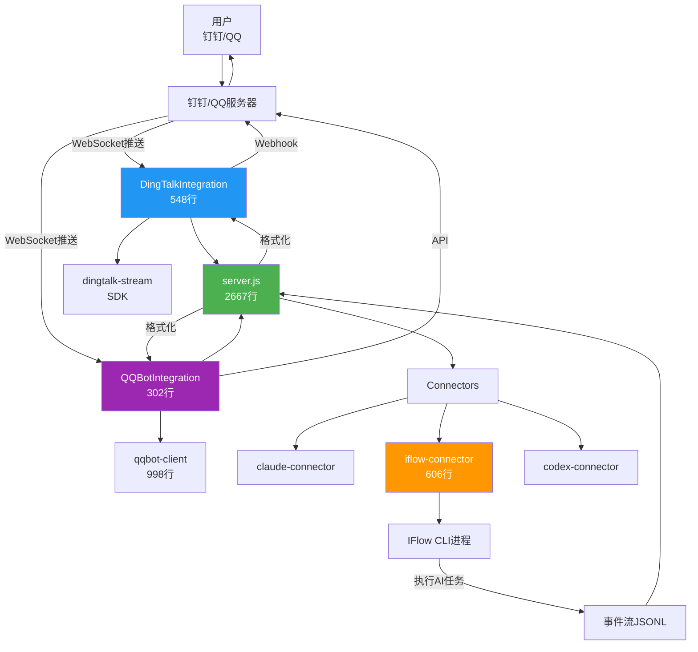
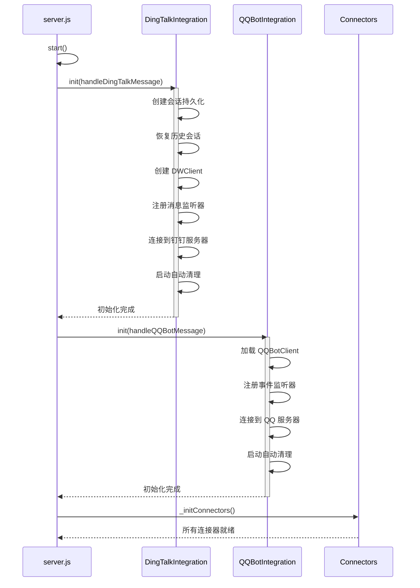
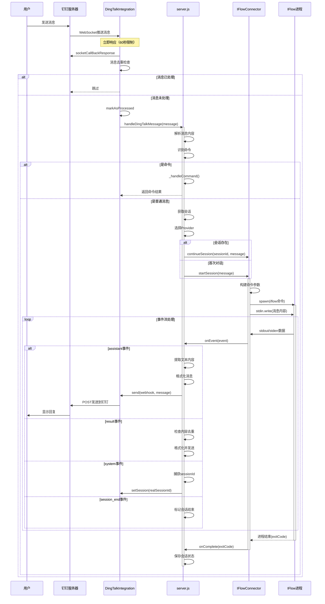
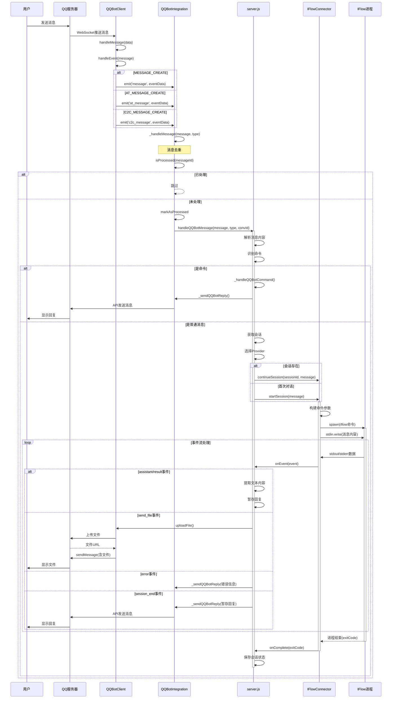
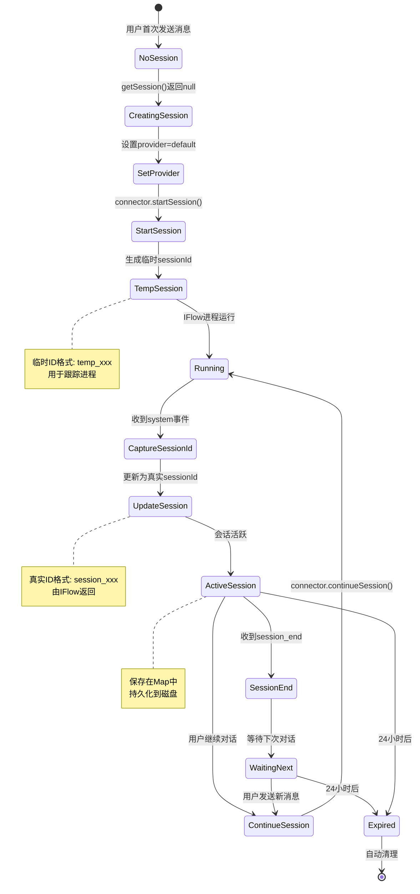
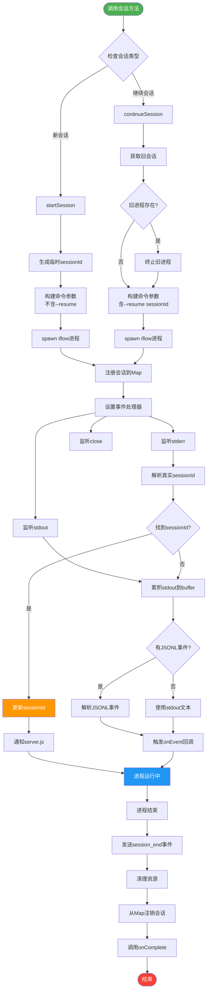
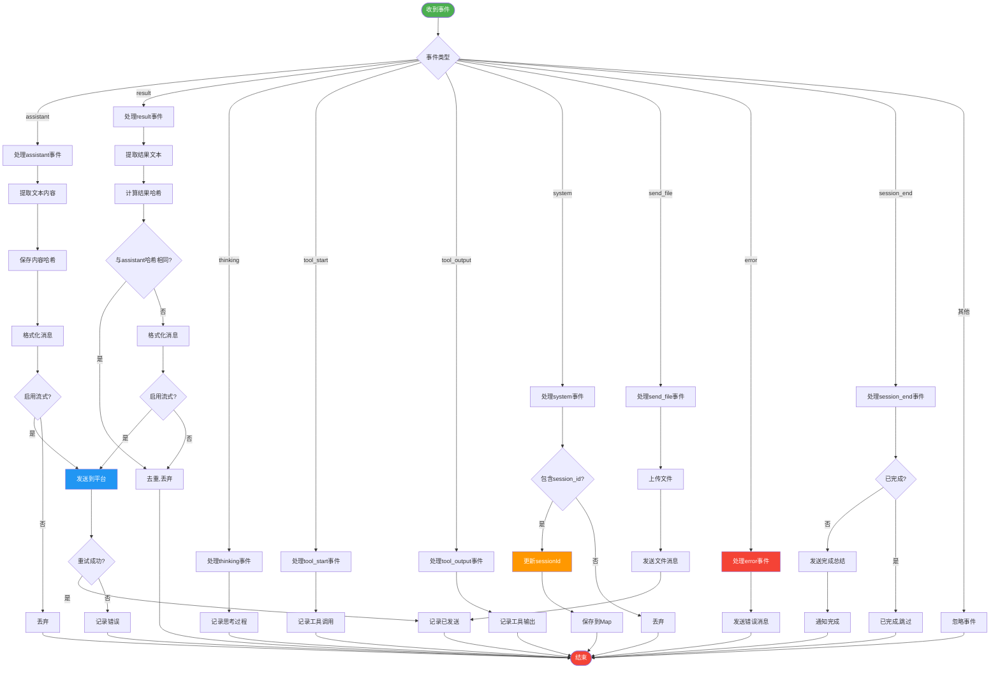
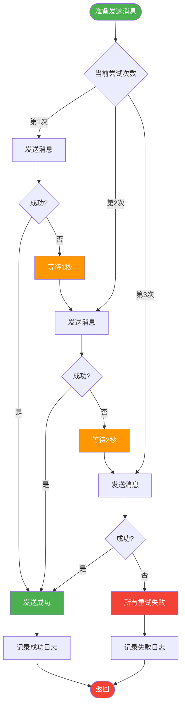
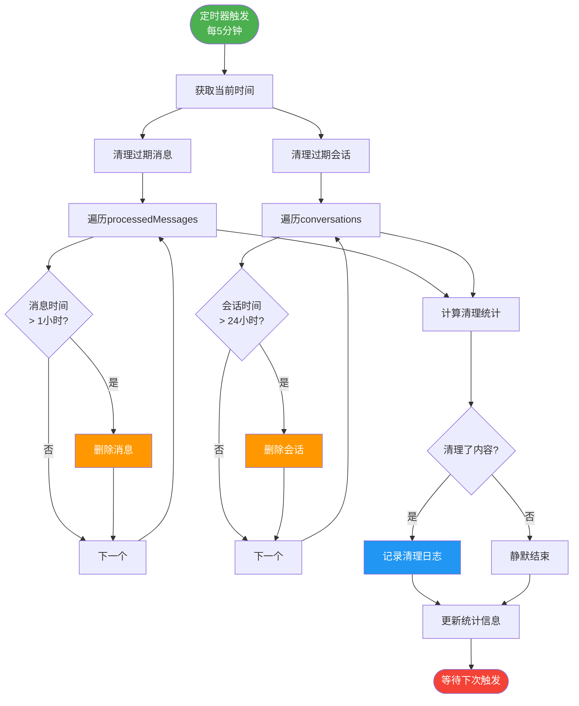
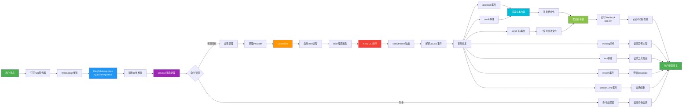

# OPRCLI 机器人调用 Agent 流程图（Mermaid 版本）

## 1. 系统架构图



## 2. 初始化流程



## 3. 钉钉消息处理完整流程



## 4. QQ Bot 消息处理完整流程



## 5. 会话管理流程



## 6. Connector 进程管理流程



## 7. 事件处理流程



## 8. 消息发送重试流程



## 9. 内存清理流程



## 10. 完整数据流向图



---

## 使用说明

这些 Mermaid 流程图可以在以下平台查看：

1. **GitHub/GitLab**：原生支持 Mermaid 渲染
2. **VS Code**：安装 "Markdown Preview Mermaid Support" 插件
3. **在线工具**：
   - https://mermaid.live/
   - https://mermaid-js.github.io/mermaid-live-editor/
4. **文档工具**：
   - Notion
   - Obsidian（安装插件）
   - Typora

### 在本地查看

```bash
# 使用 VS Code
code docs/流程图-Mermaid.md

# 或使用在线编辑器
# 复制 Mermaid 代码到 https://mermaid.live/
```

---

**生成时间：** 2026-03-07
**项目：** oprcli v1.0
**作者：** Claude Code Analysis
